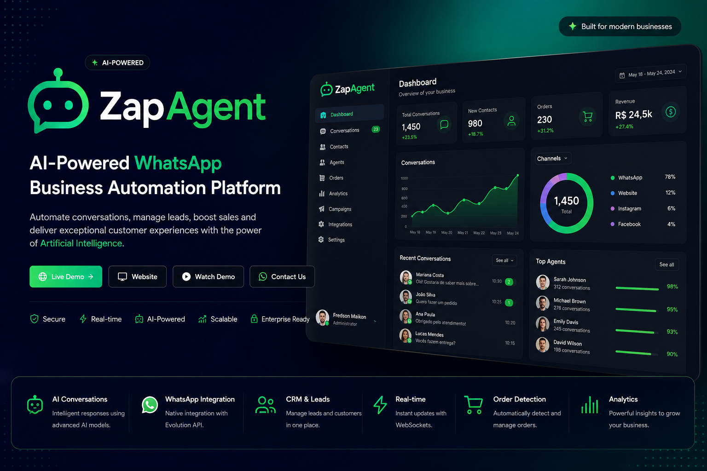

# ZapAgent

  

### AI-powered Business Communication Platform

Automate customer conversations, centralize support, manage leads and streamline business communication through WhatsApp using Artificial Intelligence.

---

## 🌐 Official Website

https://zapagent-saas-production.up.railway.app/

> A custom domain will be available soon.

---

## 🚀 Overview

ZapAgent is an AI-powered SaaS platform designed to help companies automate customer communication, improve response time and increase operational efficiency.

Instead of relying on traditional chatbots, ZapAgent combines Artificial Intelligence, CRM capabilities and real-time communication to provide a complete customer experience.

The platform is designed for companies that want to scale customer service without increasing operational costs.

---

# ✨ Key Features

* 🤖 AI Customer Support
* 💬 WhatsApp Integration
* 📈 Lead Management (CRM)
* 📦 Intelligent Order Detection
* ⚡ Real-time Dashboard
* 👥 Multi-Agent Support
* 🔔 Live Notifications
* 📊 Analytics & Metrics
* 🧠 AI Knowledge Base
* 🔄 Human Handover
* 📱 QR Code Connection
* 🏢 Multi-tenant Architecture

---

# 🖥 Product Highlights

✔ AI-powered conversations

✔ WhatsApp Business automation

✔ Lead management

✔ Conversation history

✔ Customer profile

✔ Order management

✔ Dashboard with metrics

✔ Real-time updates

✔ Modern administration panel

✔ Secure authentication

---

# 🛠 Technology Stack

Frontend

* Next.js
* React
* TypeScript

Backend

* Node.js
* Prisma ORM
* PostgreSQL

Artificial Intelligence

* Google Gemini AI

Communication

* Evolution API
* WhatsApp
* Socket.IO

Infrastructure

* Railway
* Vercel

---

# 🏗 Architecture

The platform follows a modern SaaS architecture designed for scalability and maintainability.

Main components include:

* AI Engine
* WhatsApp Integration
* CRM
* Dashboard
* Authentication
* Database
* Real-time Notifications
* Conversation Management

---

# 📷 Product Tour

The repository showcases the platform without exposing proprietary source code.

Available demonstrations include:

* Dashboard
* AI Conversations
* CRM
* Orders
* Analytics
* WhatsApp Integration
* Administration Panel

---

# 🎯 Use Cases

ZapAgent can be used by:

* Clinics
* Restaurants
* Hotels
* Real Estate Agencies
* Retail Stores
* Law Firms
* Service Companies
* Educational Institutions
* Sales Teams
* Customer Support Teams

---

# 🔒 Security

This repository is a public showcase of the ZapAgent platform.

For intellectual property protection, the source code, infrastructure configuration, internal architecture and proprietary AI implementation are not publicly available.

---

# 🗺 Roadmap

### Completed

* ✅ AI Assistant
* ✅ CRM
* ✅ WhatsApp Integration
* ✅ Real-time Dashboard
* ✅ Conversation Management
* ✅ Lead Management
* ✅ Multi-tenant Foundation
* ✅ Notifications

### In Progress

* 🚧 Voice AI
* 🚧 Instagram Integration
* 🚧 Telegram Integration
* 🚧 Advanced Analytics
* 🚧 Mobile Application

### Planned

* 📌 AI Reports
* 📌 Workflow Automation
* 📌 Knowledge Management
* 📌 API Marketplace

---

# 💼 About NexON

ZapAgent is being developed by **NexON Solutions**, focused on building modern AI-powered software solutions for businesses.

Our mission is to simplify communication, automate repetitive tasks and help companies grow through technology.

---

# 📬 Contact

🌐 Website

https://zapagent-saas-production.up.railway.app/

💼 LinkedIn

https://www.linkedin.com/in/fredsonlemos/

---

# ⭐ Support

If you found this project interesting, consider giving the repository a ⭐.

It helps increase the visibility of the project and supports its continuous development.
